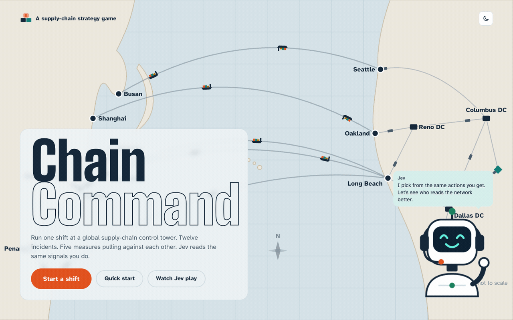
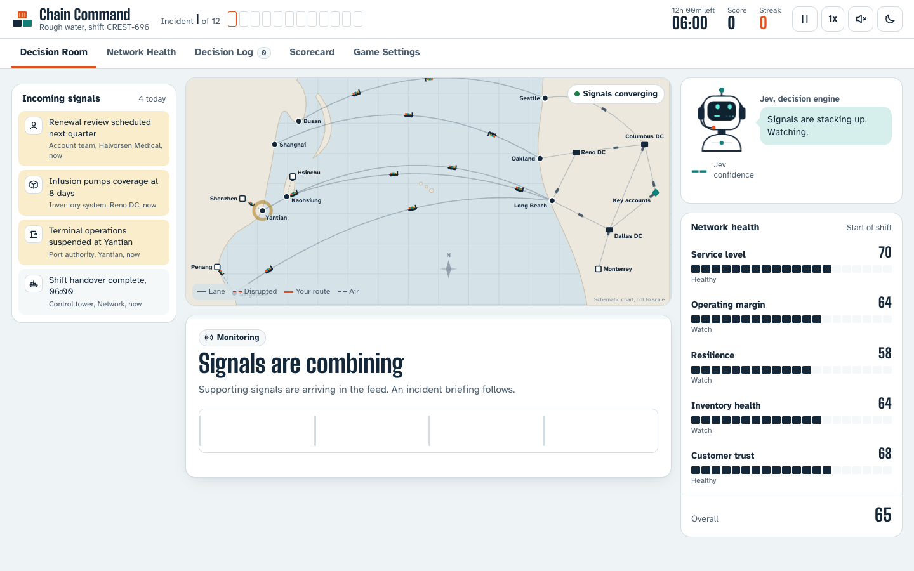
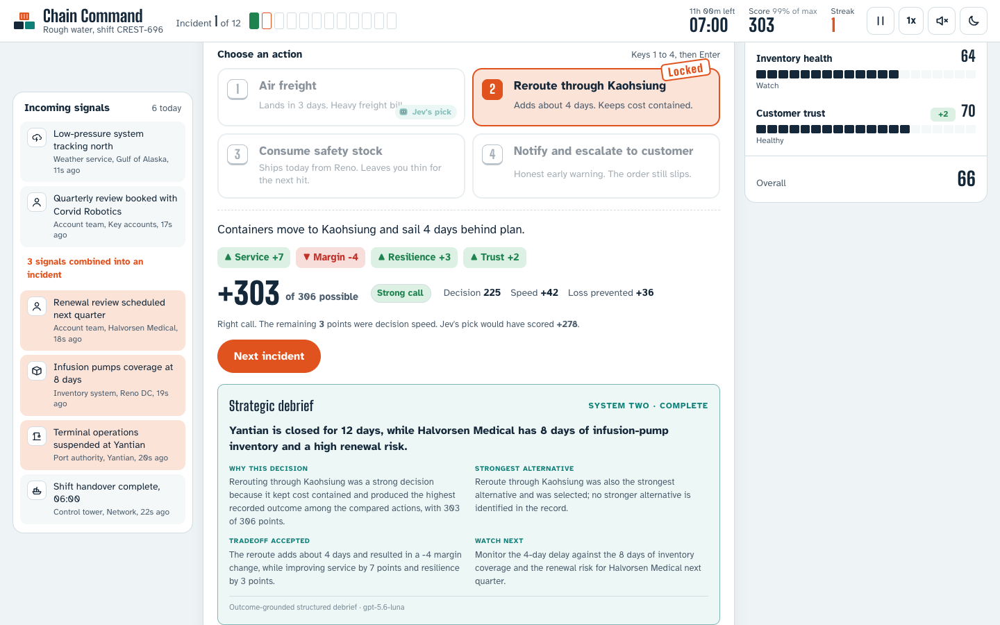

# Chain Command

Chain Command is the original playable supply-chain control-tower artifact, now connected to the `dc` native extension. It runs a complete 12-incident shift with a live signal feed, animated ships, trucks and aircraft, an expressive robot operator, difficulty modes, decision timers, carry-forward consequences, autopilot, network-health views, a decision log, and a final scorecard.

System One and System Two have distinct jobs:

1. **System One** reads the incident, evidence, current network state, recent decisions, four offered actions, and weighted criteria. It picks one valid action and returns calibrated confidence and probabilities.
2. The artifact’s **deterministic game engine** applies that action’s operational effects, points, follow-on events, and network animation.
3. **System Two** receives the chosen action, deterministic consequence, metric changes, achieved and maximum scores, strongest alternative, and resulting network state. It writes the strategic debrief shown under the incident.



*Captured from a live run using TypeSafe Jev for the bounded decision and OpenAI for the outcome-grounded strategic debrief.*

<p align="center">
  
  
</p>

## Run it

Requirements: a C++17 toolchain, libcurl, Git, [uv](https://docs.astral.sh/uv/), and credentials for the two configured providers.

```bash
export TYPESAFE_API_KEY="..."
export OPENAI_API_KEY="..."
./examples/chain-command/run.sh
```

The launcher:

- stops immediately when either credential is absent;
- installs the pinned Python environment with `uv`;
- builds the native DuckDB extension when its artifact is absent;
- creates a local DuckDB connection and provider secret in memory;
- opens `http://127.0.0.1:8787` in the default browser.

No credential is sent to the browser or written to disk. The server binds only to loopback. Override `TYPESAFE_MODEL`, `OPENAI_MODEL`, or `CHAIN_COMMAND_PORT` through environment variables. Set `CHAIN_COMMAND_OPEN_BROWSER=0` to suppress automatic browser launch.

Provider calls may incur charges. Exact incident replays use the extension’s per-connection cache. The UI identifies recalled results without changing their provenance.

## Game behavior

- Three difficulty modes: Calm seas, Rough water, and Storm season.
- Twelve incidents drawn from 27 event families, with the representative Yantian closure first.
- Decisions can drain safety stock, freeze premium-freight budgets, activate backup suppliers, or create later quality and shutdown events.
- Jev can advise a human player or run the full shift in autopilot. Full-speed autopilot keeps System Two off the critical loop; manual decisions receive a strategic debrief.
- The scorecard compares the player, maximum possible score for the encountered incidents, and Jev’s decisions.
- Keyboard controls, screen-reader announcements, text labels for status colors, captions, and reduced-motion behavior are included.

The model does not mutate the game directly. System One can return only an offered action ID; the deterministic simulator owns all consequences. System Two explains the recorded outcome and must acknowledge when another action scored better.
